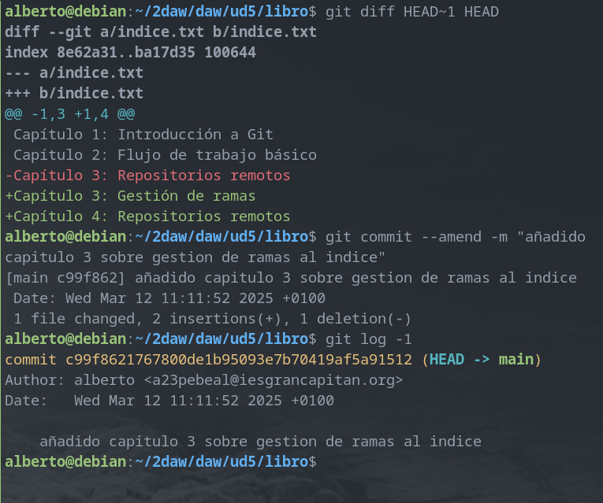

# Ejercicios de Git y GitHub

## Ejercicios de Git y GitHub (I)

### Creación del repositorio y primer commit 

Para la realización de esta práctica se ha creado un 
repositorio remoto en GitHub:


También es necesario inicializar un repositorio en local, 
indicando la URL (en mi caso uso el enlace SSH) del 
repositorio remoto como "origen" y renombrando la rama 
"master" a "main":


A continuación, se realizará un primer commit sencillo 
en el que se subirá un archivo 'README.md' a la rama 'main' 
del  repositorio remoto:


### Ignorar archivos

En ocasiones tendremos en nuestro repositorio local archivos y/o
directorios que no queremos añadir a un commit (por ejemplo, 
archivos que guarden variables de entorno). Para mostrar cómo 
ignorar archivos, se crearán un archivo y un directorio de 
ejemplo:


Y para ignorarlos (por ejemplo si ejecutásemos 'git add .'), 
creamos un archivo '.gitignore' con el siguiente contenido:

```git
privada
privada/*
privado.txt
```

### Tags

Crearemos un nuevo archivo '1.txt' y asignaremos un tag 
al commit antes de subir los cambios al repositorio remoto:


### Cuenta de GitHub

GitHub permite personalizar el perfil de la cuenta (Settings > Public profile). 
Por ejemplo, podemos poner una foto de perfil:


También es posible mejorar la seguridad de la cuenta activando la autenticación 
de dos factores (en mi caso, tengo activada la 2FA con la aplicación de autenticación 
de Google):


### Uso social de GitHub

A través de GitHub podemos visitar las cuentas de otras personas. Voy a seguir 
a dos de mis compañeros de clase:


También crearé una tabla con información de algunos de mis compañeros en el 
fichero README.md del repositorio DEAW:


### Gestión de rama v0.2

#### Creación de la rama

Creamos una rama con nombre 'v0.2', nos posicionamos sobre ella, creamos un 
fichero y subimos los cambios al repositorio remoto:


#### Merge directo

Podemos fusionar el contenido de la rama 'main' con el contenido de 'v0.2'. Como 
los archivos que comparten las dos ramas tienen el mismo contenido, simplemente se 
añadirá el archivo '2.txt' de 'v0.2' a 'main':


#### Merge conflictivo

Si quisiéramos realizar una fusión de ramas pero alguno de los archivos tuviera 
diferente contenido en cada rama, tendríamos que resolver el conflicto para que 
la fusión pueda realizarse. Por ejemplo, escribiré "Hola" en el '1.txt' de 'main' 
y "Adiós" en el mismo archivo pero en la rama 'v0.2':


Al intentar fusionar las ramas saltará un aviso debido al conflicto en el 
contenido del archivo en las diferentes ramas:


Si abrimos el archivo con un editor de texto se nos mostrará el contenido de 
ambas ramas:


Resolvemos el conflicto de contenido y confirmamos los cambios con un 'commit'.

#### Borrar rama

Creamos un tag 'v0.2' y borramos la rama con el mismo nombre:


#### Listar cambios

Para ver el historial de cambios utilizamos 'git log':


## Ejercicios de Git y GitHub (II)

### Creación y actualización de repositorios

#### Ejercicio 1

Para definir el nombre de usuario, email y activar el coloreado de salida 
ejecutamos:


Para mostrar la configuración ejecutamos:


#### Ejercicio 2

Creamos un nuevo repositorio y mostramos su contenido:


#### Ejercicio 3

Comprobamos el estado del repositorio, creamos un fichero 'indice.txt' 
y comprobamos de nuevo el estado del repositorio:


Añadimos el fichero a la zona de 'stage' y volvemos a comprobar 
el estado del repositorio:


#### Ejercicio 4

Confirmamos los cambios y volvemos a comprobar el estado del repositorio:


#### Ejercicio 5

Modificamos 'indice.txt', mostramos los cambios con respecto a los cambios 
confirmados anteriormente y confirmamos la nueva versión del archivo:


#### Ejercicio 6

Ahora mostraremos los cambios sobre la última versión del repositorio al 
completo. Después modificamos el mensaje de la última confirmación y 
veremos la última modificación realizada en el repositorio:



### Manejo del historial de cambios

#### Ejercicio 1

Mostramos el historial de cambios:


Añadimos un nuevo directorio y archivo, movemos el nuevo contenido a la 
zona de 'stage' y confirmamos los cambios:


Volvemos a mostrar el historial de cambios:


#### Ejercicio 2

Añadimos un nuevo capítulo y mostramos las diferencias entre la 
última versión y dos versiones anteriores:


#### Ejercicio 3

Añadimos un nuevo capítulo y mostramos las diferencias entre la 
primera y última versión del repositorio:


#### Ejercicio 4

Modificamos el archivo 'indice.txt', confirmamos los cambios y 
mostramos quién ha realizado los cambios sobre el fichero:


### Deshacer cambios

#### Ejercicio 1

Modificamos 'indice.txt' eliminando contenido y comprobamos el 
estado del repositorio. Después deshacemos los cambios y volvemos 
a comprobar el estado del repositorio:


#### Ejercicio 2

Volvemos a modificar 'indice.txt', añadimos los cambios a la zona 
de 'stage' y comprobamos el estado del repositorio. Después quitaremos 
los cambios de la zona de 'stage' y volvemos a comprobar el estado del 
repositorio. Por último, deshacemos los cambios y comprobamos el estado 
del repositorio:


#### Ejercicio 3

En primer lugar:

- Eliminamos la última línea del fichero indice.txt y guardarlo.
- Eliminamos el fichero capitulos/capitulo3.txt.
- Añadir un fichero nuevo capitulos/capitulo4.txt vacío.
- Añadir los cambios a la zona de intercambio temporal.

Tras los cambios, comprobamos el estado del repositorio. Después quitaremos 
los cambios de la zona de 'stage' y comprobamos el estado. Por último, 
deshacemos todos los cambios y comprobamos el estado por última vez:


#### Ejercicio 4

En primer lugar:

- Eliminar la última línea del fichero indice.txt y guardarlo.
- Eliminar el fichero capitulos/capitulo3.txt.
- Añadir los cambios a la zona de intercambio temporal y hacer un commit con el mensaje “Borrado accidental.”
- Comprobar el historial del repositorio.
- Deshacer el último commit pero mantener los cambios anteriores en el directorio de trabajo y la zona de intercambio temporal.


En segundo lugar:

- Comprobar el historial y el estado del repositorio.
- Volver a hacer el commit con el mismo mensaje de antes.
- Deshacer el último commit y los cambios anteriores del directorio de trabajo volviendo a la versión anterior del repositorio.
- Comprobar de nuevo el historial y el estado del repositorio.


### Gestión de ramas

#### Ejercicio 1

Creamos una nueva rama y mostramos todas las ramas del repositorio:


#### Ejercicio 2

Creamos 'capitulos/capitulo4.txt', confirmamos los cambios y 
mostramos el historial de todas las ramas:


#### Ejercicio 3

Nos movemos a la rama 'bibliografia', creamos un archivo de texto 
con el miso nombre y confirmamos los cambios, luego mostramos el 
historial con todas las ramas:


#### Ejercicio 4

Fusionamos 'bibliografia' con 'main', mostramos el historial, 
eliminamos 'bibliografia' y volvemos a mostrar el historial:


#### Ejercicio 5

Creamos una nueva rama 'bibliografia', modificamos 'bibliografia.txt' y 
confirmamos los cambios. Modificamos el mismo archivo en la rama 'main', 
los confirmamos y fusionamos las ramas resolviendo el conflicto en el 
fichero:


Mostramos el historial del repositorio:


### Repositorios remotos

#### Ejercicio 1

Creamos un nuevo repositorio en GitHub 'libro-git':


Lo añadimos al repositorio local y mostramos los repositorios remotos:


#### Ejercicio 2

Subimos los cambios al repositorio remoto con:

```console
git push origin main
```

Comprobamos el historial de versiones del repositorio remoto:


